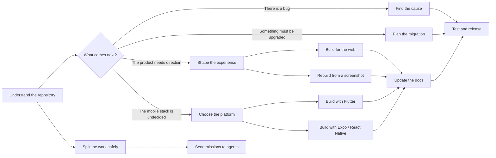

# Codex Toolkit

> A practical set of Codex skills for working on real software projects.

[](LICENSE)
[](skills)
[](agents/mission-control)
[](evaluations/README.md)

Codex is already good at writing code. The harder part is helping it understand a large repository, choose the right approach, keep parallel changes from colliding, and know when the result is actually ready to ship.

This repository gives Codex repeatable ways to handle those jobs. It includes 13 skills for repository analysis, debugging, migrations, design, web and mobile development, documentation, testing, releases, and multi-agent work.

You can install only the skill you need. They also work together when a task grows into something larger.

## Find the right skill

| What are you trying to do? | Start here |
| --- | --- |
| Understand an unfamiliar repository or see what a change might affect | [`repository-intelligence`](skills/repository-intelligence) |
| Split known work between agents without overlapping edits | [`multi-agent-work-coordinator`](skills/multi-agent-work-coordinator) |
| Send well-defined tasks to specialized reader and writer agents | [`delegate-with-mission-cards`](skills/delegate-with-mission-cards) |
| Upgrade a framework, dependency, database schema, API, or runtime | [`codebase-evolution-controller`](skills/codebase-evolution-controller) |
| Track down a bug when the cause is still unclear | [`debugging-investigator`](skills/debugging-investigator) |
| Decide what needs testing or whether a change is ready to release | [`verification-and-release`](skills/verification-and-release) |
| Update guides, API docs, examples, configuration, and runbooks after a change | [`documentation-synchronizer`](skills/documentation-synchronizer) |
| Work out how a product should look, feel, and behave | [`product-design-director`](skills/product-design-director) |
| Turn a screenshot or visual reference into a responsive interface | [`screenshot-to-interface`](skills/screenshot-to-interface) |
| Build or improve a production web application | [`production-web-builder`](skills/production-web-builder) |
| Choose between Flutter, Expo/React Native, native, or another mobile approach | [`mobile-architecture-director`](skills/mobile-architecture-director) |
| Build an app after Flutter has already been chosen | [`flutter-production-builder`](skills/flutter-production-builder) |
| Build an app after Expo or React Native has already been chosen | [`expo-react-native-builder`](skills/expo-react-native-builder) |

You do not need to run a whole chain for every task. Use the smallest skill that matches the decision in front of you.

## Install a skill

See everything available in the repository:

```shell
npx skills add https://github.com/cmdr-chara/codex-toolkit --list
```

Then install the one you want:

```shell
npx skills add https://github.com/cmdr-chara/codex-toolkit --skill "repository-intelligence" -g
```

Replace `repository-intelligence` with any name from the table above. Start a fresh Codex task after installing so Codex can load it.

You can ask normally, or name the skill directly:

```text
Use $repository-intelligence to map this monorepo before we change authentication.
```

```text
Use $mobile-architecture-director to help us choose between Flutter and Expo.
```

```text
Use $production-web-builder to build this checkout flow and verify it in a browser.
```

## How the skills work together

Here is one possible path through the toolkit:



For example, a large modernization might start with `repository-intelligence`, move through `codebase-evolution-controller`, use `multi-agent-work-coordinator` to divide the work, and finish with `verification-and-release`.

A smaller bug fix may only need `debugging-investigator` and the relevant builder.

## Mission Control

Mission Control is the optional multi-agent part of the toolkit. It adds six custom agents and the `delegate-with-mission-cards` skill.

Install it with:

```shell
npx --yes github:cmdr-chara/codex-toolkit
```

On Windows, you can also clone the repository and run:

```powershell
.\scripts\install-mission-control.ps1
```

The installer backs up conflicting Mission Control files under `~/.codex/backups` before replacing them.

| Role | Model | Good fit for |
| --- | --- | --- |
| `pathfinder-reader` | GPT-5.6 Luna | Quickly finding files, symbols, and narrow facts |
| `patcher-writer` | GPT-5.6 Luna | Small, isolated edits that are easy to verify |
| `investigator-reader` | GPT-5.6 Terra | Debugging, tracing behavior, reviews, and comparisons |
| `builder-writer` | GPT-5.6 Terra | Features, tests, fixes, documentation, and configuration |
| `sentinel-reader` | GPT-5.6 Sol | Security, privacy, migrations, and other high-risk analysis |
| `architect-writer` | GPT-5.6 Sol | Architecture changes and difficult, failure-sensitive work |

`multi-agent-work-coordinator` decides how the work should be divided. Mission Control chooses the right agent for each approved piece of work. This keeps planning and model selection separate.

## What is inside a skill?

These skills are more than short prompt templates. Depending on the job, a skill may include:

- clear examples of when it should and should not be used;
- a step-by-step working process;
- rules for preserving uncommitted work and avoiding risky changes;
- checklists for handoffs, failures, and stopping points;
- current web, Flutter, and Expo package research;
- small read-only scripts for inspecting a repository;
- tests for confusing cases where two skills might otherwise compete.

The package guidance is conditional. A skill should inspect the existing project before suggesting a new dependency, and it should prefer built-in tools when they are enough.

## Check the toolkit

The repository includes two local checks. One checks the structure, links, metadata, research dates, licenses, and Python scripts. The other runs every helper against temporary sample projects and confirms that none of them changes the input files.

```shell
python scripts/validate_skill_pack.py . --as-of 2026-07-17
python scripts/run_smoke_tests.py . --as-of 2026-07-17
```

After installing the skills, [`evaluations/post-install-routing-smoke.md`](evaluations/post-install-routing-smoke.md) provides a short live routing test. The full test notes are in [`evaluations/README.md`](evaluations/README.md).

## Repository layout

```text
agents/       The six optional Mission Control agents
docs/         Design notes, skill boundaries, and research sources
evaluations/  Routing cases and realistic workflow checks
scripts/      Installers, validators, and read-only test helpers
skills/       The 13 installable Codex skills
```

You can also browse the compact skill catalog in [`skills/llms.txt`](skills/llms.txt) and see release history in [`CHANGELOG.md`](CHANGELOG.md).

## Research and credit

The web and mobile package research was last checked on **2026-07-17**. Those references include review dates because frameworks and package recommendations change. Always compare them with the versions in the project you are working on.

`product-design-director` and `screenshot-to-interface` build on ideas from Leonxlnx's MIT-licensed Taste Skill project. [`THIRD_PARTY_NOTICES.md`](THIRD_PARTY_NOTICES.md) contains the original license, source mapping, and a summary of the changes made here.

## License

[MIT](LICENSE) © 2026 cmdr-chara
