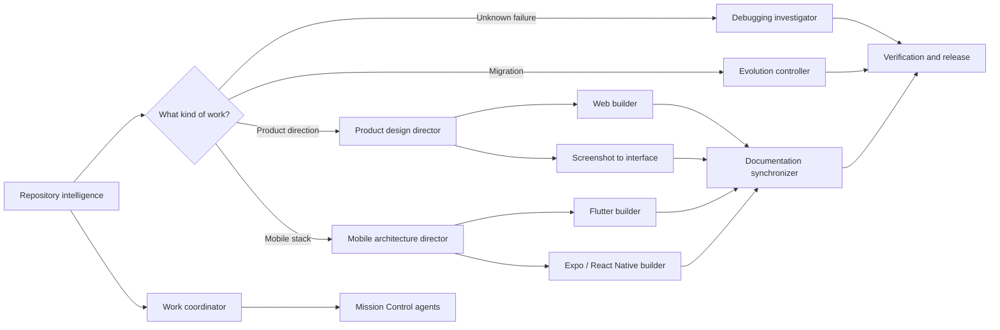

# Codex Toolkit

> Production-grade skills for understanding, changing, designing, debugging, and shipping real software with Codex.

[](LICENSE)
[](skills)
[](agents/mission-control)
[](evaluations/README.md)

Codex Toolkit is a set of focused Agent Skills—not a pile of generic prompts. Each skill owns a clear decision, states when it should *not* activate, preserves user work, and defines evidence, handoffs, failure handling, and stop conditions.

Use one skill for a focused task or compose them into a complete engineering workflow. The toolkit includes 12 portable production workflows plus **Mission Control**, an optional six-agent delegation system.

## Choose a skill

| If you need to… | Use |
| --- | --- |
| Understand an unfamiliar repository, ownership, hotspots, or blast radius | [`repository-intelligence`](skills/repository-intelligence) |
| Turn mapped work into safe parallel waves with exclusive file ownership | [`multi-agent-work-coordinator`](skills/multi-agent-work-coordinator) |
| Delegate bounded missions to specialized reader and writer agents | [`delegate-with-mission-cards`](skills/delegate-with-mission-cards) |
| Upgrade a framework, dependency, schema, API, or runtime safely | [`codebase-evolution-controller`](skills/codebase-evolution-controller) |
| Investigate an unknown failure and prove the root cause | [`debugging-investigator`](skills/debugging-investigator) |
| Build a risk-based test plan or make a release decision | [`verification-and-release`](skills/verification-and-release) |
| Keep guides, API references, examples, and runbooks aligned with code | [`documentation-synchronizer`](skills/documentation-synchronizer) |
| Define product UX, visual direction, responsive rules, and accessibility intent | [`product-design-director`](skills/product-design-director) |
| Reconstruct a supplied screenshot as a maintainable responsive interface | [`screenshot-to-interface`](skills/screenshot-to-interface) |
| Implement a production web feature from an approved direction | [`production-web-builder`](skills/production-web-builder) |
| Choose between Flutter, Expo/React Native, native, or another mobile stack | [`mobile-architecture-director`](skills/mobile-architecture-director) |
| Build within an already-selected Flutter architecture | [`flutter-production-builder`](skills/flutter-production-builder) |
| Build within an already-selected Expo/React Native architecture | [`expo-react-native-builder`](skills/expo-react-native-builder) |

## How the toolkit fits together



The arrows are handoffs, not mandatory ceremony. Codex should activate only the smallest workflow that owns the current decision.

## Install portable skills

List every skill published by this repository:

```shell
npx skills add https://github.com/cmdr-chara/codex-toolkit --list
```

Install one globally by its stable folder name:

```shell
npx skills add https://github.com/cmdr-chara/codex-toolkit --skill "repository-intelligence" -g
```

Replace the skill name with any entry from the table above. Start a fresh Codex task after installation so the new metadata is loaded.

Then ask naturally or invoke a skill explicitly:

```text
Use $repository-intelligence to map this monorepo before we change authentication.
```

```text
Use $mobile-architecture-director to choose between Flutter and Expo for this product.
```

```text
Use $production-web-builder to implement the approved checkout design and verify it in a browser.
```

## Install Mission Control

Mission Control adds six model-routed custom agents alongside `delegate-with-mission-cards`. The one-command installer is intentionally scoped to this delegation bundle; portable workflow skills are installed with the skills CLI above.

```shell
npx --yes github:cmdr-chara/codex-toolkit
```

Or from a cloned checkout on Windows:

```powershell
.\scripts\install-mission-control.ps1
```

Conflicting Mission Control files are moved into a timestamped backup under `~/.codex/backups`. The included roles are:

| Role | Model | Effort | Best for |
| --- | --- | --- | --- |
| `pathfinder-reader` | GPT-5.6 Luna | Medium | Fast reconnaissance and narrow codebase facts |
| `patcher-writer` | GPT-5.6 Luna | High | Tiny, isolated, reversible edits |
| `investigator-reader` | GPT-5.6 Terra | High | Debugging, tracing, reviews, and comparisons |
| `builder-writer` | GPT-5.6 Terra | High | Standard features, tests, fixes, and documentation |
| `sentinel-reader` | GPT-5.6 Sol | XHigh | Security, privacy, migrations, and subtle high-risk analysis |
| `architect-writer` | GPT-5.6 Sol | XHigh | Architecture changes and failure-sensitive implementation |

The generic coordinator decides *how work is divided*. Mission Control decides *which specialized role receives each approved mission*. They complement each other without duplicating ownership.

## Example workflows

**Build a new product feature**

```text
repository-intelligence
→ product-design-director
→ production-web-builder, flutter-production-builder, or expo-react-native-builder
→ documentation-synchronizer
→ verification-and-release
```

**Modernize a large codebase safely**

```text
repository-intelligence
→ codebase-evolution-controller
→ multi-agent-work-coordinator
→ delegate-with-mission-cards
→ verification-and-release
```

**Resolve an unclear production regression**

```text
debugging-investigator
→ the relevant builder or evolution controller
→ documentation-synchronizer when behavior changed
→ verification-and-release
```

## What makes these skills different

- **Precise routing:** positive triggers, negative triggers, and overlap cases keep similar skills from competing.
- **Repository-aware decisions:** inspect the actual stack and conventions before recommending dependencies or architecture.
- **Evidence over confidence:** material claims require files, commands, test output, primary sources, or an explicit unknown.
- **Safe collaboration:** preserve uncommitted work, assign exclusive write ownership, and verify every handoff.
- **Conditional package guidance:** web, Flutter, and Expo references include compatibility, maintenance, license, security, cost, built-in alternatives, and choose/avoid criteria.
- **Read-only helpers:** inventory scripts inspect repositories without installing packages, contacting networks, or modifying target files.

## Validate the toolkit

The structural validator checks all skill resources, routing fixtures, dated research, local links, metadata, provenance, script syntax, and unsafe patterns. The smoke harness runs all eight helper scripts against disposable synthetic repositories and verifies byte-for-byte that inputs remain unchanged.

```shell
python scripts/validate_skill_pack.py . --as-of 2026-07-17
python scripts/run_smoke_tests.py . --as-of 2026-07-17
```

After installing, use [`evaluations/post-install-routing-smoke.md`](evaluations/post-install-routing-smoke.md) to test live Codex routing. The complete evaluation protocol is documented in [`evaluations/README.md`](evaluations/README.md).

## Repository map

```text
agents/       Mission Control custom-agent definitions
docs/         Responsibility boundaries, design rationale, and research ledger
evaluations/  Routing, overlap, workflow, provenance, and package-claim checks
scripts/      Installers plus structural and network-free smoke tests
skills/       Thirteen independently installable Agent Skills
```

The compact machine-readable catalog lives in [`skills/llms.txt`](skills/llms.txt). Release history is in [`CHANGELOG.md`](CHANGELOG.md).

## Research and attribution

Time-sensitive web and mobile ecosystem guidance was checked on **2026-07-17** and carries explicit refresh dates. Resolve final versions against the target repository, current security advisories, and official package sources.

`product-design-director` and `screenshot-to-interface` adapt ideas from Leonxlnx's MIT-licensed Taste Skill project. The complete license text, source mapping, and modification notice are preserved in [`THIRD_PARTY_NOTICES.md`](THIRD_PARTY_NOTICES.md).

## License

[MIT](LICENSE) © 2026 cmdr-chara
