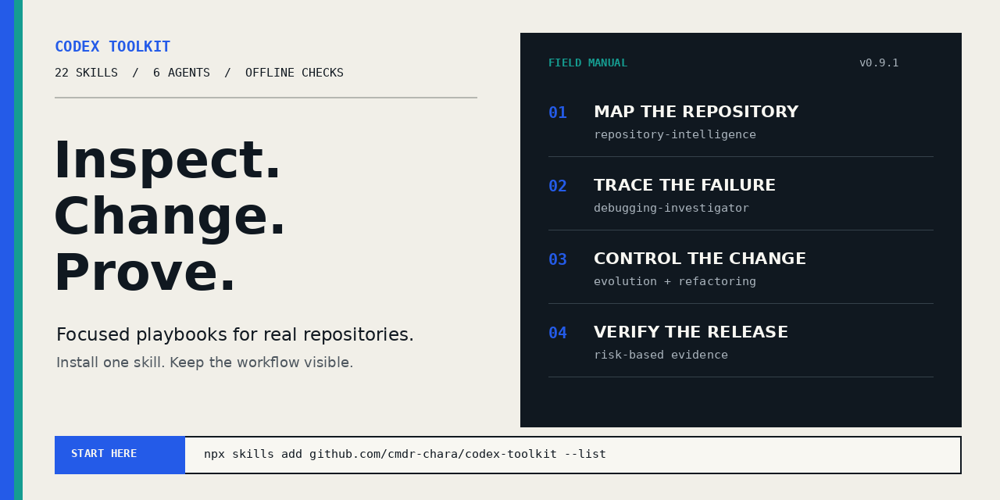

# Codex Toolkit

> Eighteen focused Codex skills for understanding, changing, and verifying real software projects.

[](https://github.com/cmdr-chara/codex-toolkit/actions/workflows/ci.yml)
[](LICENSE)
[](skills)
[](agents/mission-control)

<p align="center">
  
</p>

Codex can write code without this toolkit. The skills here are for the parts around the code: tracing an unfamiliar system, controlling scope, checking assumptions, preserving behavior, and deciding what evidence is enough to ship.

Each skill is installable independently. Most are self-contained; integrations that use an external service make that dependency explicit rather than relying on a hidden shared runtime.

## Install one useful skill

List the collection:

```sh
npx skills add https://github.com/cmdr-chara/codex-toolkit --list
```

Install the repository investigator globally:

```sh
npx skills add https://github.com/cmdr-chara/codex-toolkit --skill "repository-intelligence" -g
```

Start a fresh Codex task and ask normally, or name it explicitly:

```text
Use $repository-intelligence to map this repository before we change the billing flow.
```

For a bug investigation instead, replace it with `debugging-investigator`. The table below covers every option.

## Pick a skill

### Understand and change code

| You want to... | Use |
| --- | --- |
| Understand an unfamiliar repository or see what a change could affect | [repository-intelligence](skills/repository-intelligence) |
| Discover and rank what the codebase should improve next | [codebase-improvement-planner](skills/codebase-improvement-planner) |
| Strengthen TypeScript/JavaScript type evidence and deterministic lint enforcement | [typescript-quality-enforcer](skills/typescript-quality-enforcer) |
| Inspect or sanitize provenance/metadata in user-owned text, images, PDFs, or documents | [content-provenance-hygiene](skills/content-provenance-hygiene) |
| Review a change or plan a safe refactor | [review-and-refactor-code](skills/review-and-refactor-code) |
| Find the cause of a bug or regression | [debugging-investigator](skills/debugging-investigator) |
| Measure a slow path and plan an optimization | [optimize-codebase-performance](skills/optimize-codebase-performance) |
| Upgrade a dependency, framework, schema, API, or runtime | [codebase-evolution-controller](skills/codebase-evolution-controller) |
| Update guides, examples, API docs, configuration, or runbooks | [documentation-synchronizer](skills/documentation-synchronizer) |
| Decide what must be tested or whether a release is ready | [verification-and-release](skills/verification-and-release) |

Open-ended codebase improvement, TypeScript quality enforcement, review/refactor, and performance requests start with inspection and a proposal. They do not expand into broad edits until you approve the proposed batch. Content provenance hygiene also inspects first and widens beyond the requested deterministic sanitation scope only with explicit approval.

### Build products and interfaces

| You want to... | Use |
| --- | --- |
| Decide how a product should look and behave | [product-design-director](skills/product-design-director) |
| Rebuild an interface from screenshots | [screenshot-to-interface](skills/screenshot-to-interface) |
| Build or audit a production web app | [production-web-builder](skills/production-web-builder) |
| Choose between Flutter, Expo/React Native, native, or another mobile approach | [mobile-architecture-director](skills/mobile-architecture-director) |
| Build an app after Flutter is chosen | [flutter-production-builder](skills/flutter-production-builder) |
| Build an app after Expo or React Native is chosen | [expo-react-native-builder](skills/expo-react-native-builder) |

### Work with multiple agents

| You want to... | Use |
| --- | --- |
| Split understood work into safe, non-overlapping tasks | [multi-agent-work-coordinator](skills/multi-agent-work-coordinator) |
| Send approved tasks to the toolkit's reader and writer agents | [delegate-with-mission-cards](skills/delegate-with-mission-cards) |

Use the smallest skill that owns the decision in front of you. A skill can hand off to another one when the task changes.

## How skills work together

A task does not need every skill. Common paths are:

- Unknown repository -> repository-intelligence -> the relevant implementation skill.
- Open-ended “improve this codebase” request -> codebase-improvement-planner -> the specialist that owns the selected upgrade.
- Repeated TypeScript type-evidence/lint debt -> typescript-quality-enforcer -> staged deterministic enforcement or the specialist that owns an architectural finding.
- User-owned artifact with provenance/metadata concerns -> content-provenance-hygiene -> inspect -> approved sanitation -> re-inspect.
- Bug with an unknown cause -> debugging-investigator -> a focused fix -> verification-and-release.
- Requested cleanup -> review-and-refactor-code -> your approval -> incremental refactor.
- Slow critical path -> optimize-codebase-performance -> your approval -> measured optimization.
- Framework or schema upgrade -> codebase-evolution-controller -> documentation-synchronizer -> verification-and-release.
- New product direction -> product-design-director -> a web or mobile builder.

The builder verifies its own change. Verification-and-release makes the final decision about the integrated release.

## Mission Control

Mission Control is optional and separate from the individual skill install above. It adds six custom agents plus `delegate-with-mission-cards` for tasks that are already understood well enough to split safely.

The current routing is designed for Codex Subagents V2: Luna Max is the default tier for ordinary reader and writer missions, Sol High handles high-risk read-only review, and Sol Max is reserved for extreme-risk implementation. OpenAI's public model guide documents Luna, Sol, and these reasoning controls; it does not yet use the public label “Subagents V2.”

Install it directly from GitHub:

    npx --yes github:cmdr-chara/codex-toolkit

On Windows, a cloned checkout can use:

    .\scripts\install-mission-control.ps1

Existing Mission Control files are backed up under ~/.codex/backups before replacement.

| Agent | Best for | Route |
| --- | --- | --- |
| pathfinder-reader | Fast file, symbol, and fact lookup | Luna Max |
| patcher-writer | Small isolated edits | Luna Max |
| investigator-reader | Debugging, tracing, and focused reviews | Luna Max |
| builder-writer | Features, tests, fixes, docs, and configuration | Luna Max |
| sentinel-reader | Security, privacy, migrations, and other high-risk analysis | Sol High |
| architect-writer | Difficult architecture and failure-sensitive changes | Sol Max |

The coordinator decides how work is divided. Mission Control chooses an agent for each approved task. The parent Codex task still owns integration and final verification.

## What is inside

Each skill is an installable folder with:

- SKILL.md for its trigger, workflow, safety rules, and stopping points;
- agents/openai.yaml for the name and prompt shown in Codex;
- optional references for detail that should load only when needed;
- optional read-only scripts for deterministic inspection.

Skills are designed to install independently. No skill depends on a hidden shared runtime folder; an explicit optional external integration such as the provenance-hygiene service remains operator-controlled and is never silently installed.

## Check the toolkit

The checks run without network access and do not modify their fixture projects.

Run the structural validator:

    python scripts/validate_skill_pack.py . --as-of 2026-08-16

Run the network-free helper smoke tests:

    python scripts/run_smoke_tests.py . --as-of 2026-08-16

The structural check covers skill metadata, links, routing cases, references, licensing, and Python safety rules. The smoke suite runs every helper against temporary sample projects and confirms that fixture inputs do not change.

CI also inspects the npm package contents and installs Mission Control into an isolated temporary Codex home. It never writes to the runner's real Codex configuration.

See [the evaluation guide](evaluations/README.md) for routing and workflow tests.

## Repository layout

| Folder | Contents |
| --- | --- |
| agents | Six optional Mission Control agents |
| docs | Design decisions, boundaries, and research sources |
| evaluations | Routing, overlap, workflow, and smoke-test cases |
| scripts | Installers and validation tools |
| skills | Eighteen installable skills |

## Research and credit

Codex model routing was refreshed on 2026-08-16; broader web research was refreshed on 2026-07-31, and mobile research was checked on 2026-07-17. Always compare it with the versions and lockfiles in the project you are changing.

Product design and screenshot reconstruction include adaptations from Leonxlnx's MIT-licensed Taste Skill project. [THIRD_PARTY_NOTICES.md](THIRD_PARTY_NOTICES.md) contains the license and source mapping.

The TypeScript quality enforcer vendors the deterministic Oxlint runtime from Dillon Mulroy's MIT-licensed `anti-slop` project at a pinned upstream revision. The surrounding staged-adoption workflow, inventory, routing, and verification are toolkit integration work; attribution and the upstream license are preserved in [THIRD_PARTY_NOTICES.md](THIRD_PARTY_NOTICES.md).

Content provenance hygiene was designed after inspecting Guillaume Meyer's MIT-licensed `watermarks-remover` service and skill. Codex Toolkit does not vendor that runtime or copy its cleaning implementation; the optional thin-client protocol reference pins the inspected revision in [skills/content-provenance-hygiene/references/service-protocol.md](skills/content-provenance-hygiene/references/service-protocol.md).

The code-review, refactoring, performance, and codebase-improvement skills were independently authored after inspecting an unlicensed public skill collection. No source prose or code was copied. The research record is in [docs/research-ledger.md](docs/research-ledger.md).

## Contributing

Bug reports, routing examples, and focused skill improvements are welcome. Read [CONTRIBUTING.md](CONTRIBUTING.md) before opening a pull request; it lists the checks and evidence expected for each kind of change.

## License

[MIT](LICENSE) Copyright 2026 cmdr-chara
