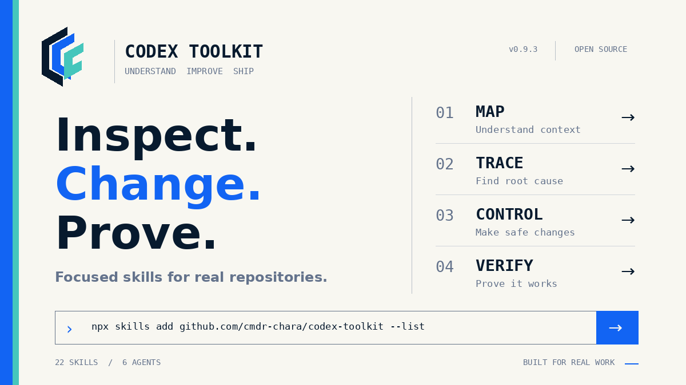

# Codex Toolkit

> 22 focused Codex skills and 6 optional agents for real software projects.

[](https://github.com/cmdr-chara/codex-toolkit/actions/workflows/ci.yml)
[](LICENSE)
[](skills)
[](agents/mission-control)

<p align="center">
  
</p>

## What is Codex Toolkit?

Codex Toolkit gives Codex a set of focused workflows for common software-engineering jobs.

You do **not** need to learn the skill names or choose one manually. Install the toolkit, then describe what you want in normal language.

For example:

```text
Find important bugs in this repository.
```

```text
Make this API faster and prove the improvement.
```

```text
Upgrade this framework without breaking compatibility.
```

```text
Review this authentication change for security problems.
```

```text
Finish this feature completely and verify it before saying it is done.
```

Codex Toolkit picks the smallest relevant workflow and loads extra guidance only when it is needed.

## Quick start

### 1. Install

You need **Node.js 18+** and Codex.

```sh
npx --yes github:cmdr-chara/codex-toolkit setup
```

That installs:

- **22 Codex skills**
- **6 optional Mission Control agents**
- automatic workflow routing
- automatic updates from published GitHub releases

### 2. Use Codex normally

Just ask for the outcome you want.

```text
Fix this intermittent reconnect bug properly.
```

```text
Inspect this codebase and tell me what is worth improving next.
```

```text
Build this approved web feature and do not stop half-finished.
```

```text
Is this release actually safe to ship?
```

You can still name a skill explicitly when you want to, but you usually do not need to.

## What can it help with?

### Understand and investigate

| You want to... | Toolkit skill |
| --- | --- |
| Understand an unfamiliar repository | [repository-intelligence](skills/repository-intelligence) |
| Find bugs nobody has reported yet | [bug-finder](skills/bug-finder) |
| Find the root cause of a known bug | [debugging-investigator](skills/debugging-investigator) |
| Fix a broken shell, runtime, package-manager, browser, or encoding path | [toolchain-preflight](skills/toolchain-preflight) |
| Review security-sensitive code | [security-review](skills/security-review) |

### Improve existing code

| You want to... | Toolkit skill |
| --- | --- |
| Decide what is worth improving next | [codebase-improvement-planner](skills/codebase-improvement-planner) |
| Review or refactor code safely | [review-and-refactor-code](skills/review-and-refactor-code) |
| Make a slow path faster using measurements | [optimize-codebase-performance](skills/optimize-codebase-performance) |
| Improve TypeScript type safety and lint discipline | [typescript-quality-enforcer](skills/typescript-quality-enforcer) |
| Upgrade dependencies, frameworks, APIs, schemas, or runtimes | [codebase-evolution-controller](skills/codebase-evolution-controller) |
| Keep documentation in sync with implementation | [documentation-synchronizer](skills/documentation-synchronizer) |

### Build products and interfaces

| You want to... | Toolkit skill |
| --- | --- |
| Define product UX and visual direction | [product-design-director](skills/product-design-director) |
| Rebuild an interface from screenshots | [screenshot-to-interface](skills/screenshot-to-interface) |
| Build or audit a production web app | [production-web-builder](skills/production-web-builder) |
| Choose a mobile architecture | [mobile-architecture-director](skills/mobile-architecture-director) |
| Build or audit a Flutter app | [flutter-production-builder](skills/flutter-production-builder) |
| Build or audit an Expo / React Native app | [expo-react-native-builder](skills/expo-react-native-builder) |

### Finish and coordinate work

| You want to... | Toolkit skill |
| --- | --- |
| Finish a substantial task without premature "done" claims | [unlazy](skills/unlazy) |
| Decide whether an integrated change is ready to ship | [verification-and-release](skills/verification-and-release) |
| Split work safely across multiple agents | [multi-agent-work-coordinator](skills/multi-agent-work-coordinator) |
| Delegate bounded work to the included agents | [delegate-with-mission-cards](skills/delegate-with-mission-cards) |
| Inspect or clean provenance and metadata in files you own | [content-provenance-hygiene](skills/content-provenance-hygiene) |

## How it works

A **skill** is a focused set of instructions for one kind of job.

Codex Toolkit keeps the process simple:

1. It reads what you asked for.
2. It selects the skill that owns that job.
3. It loads extra references only when they are relevant.
4. It keeps project-specific instructions in control.
5. It hands work to another specialist only when the task actually changes.

This means a simple bug fix stays simple, while a larger migration or release can use more structure when needed.

Your repository's own `AGENTS.md` always takes priority over the toolkit's general guidance.

## Automatic updates

The full setup installs an updater that follows **published GitHub releases**, not unreleased commits on `main`.

Future releases can add skills, improve workflows, and update routing without requiring another manual install.

Check update status:

```sh
npx --yes github:cmdr-chara/codex-toolkit auto-update status
```

Disable automatic updates:

```sh
npx --yes github:cmdr-chara/codex-toolkit auto-update remove
```

The installer does not replace your global Codex `AGENTS.md`. It manages only its own marked section and leaves the rest of your file untouched.

See [Automatic updates](docs/auto-update.md) for Windows, macOS, Linux, custom `CODEX_HOME`, and scheduler details.

## Want only one skill?

Every skill can also be installed independently.

List the available skills:

```sh
npx skills add https://github.com/cmdr-chara/codex-toolkit --list
```

Install one skill:

```sh
npx skills add https://github.com/cmdr-chara/codex-toolkit --skill repository-intelligence -g -a codex
```

A single-skill install does not add the toolkit's automatic routing, Mission Control agents, or updater.

## Mission Control

The full setup also includes six optional agents for work that can be split safely.

You do not need to configure or call them manually. The toolkit can use them when separate pieces of work have clear boundaries and can be checked independently.

<details>
<summary><strong>Mission Control agents</strong></summary>

| Agent | Best for |
| --- | --- |
| `pathfinder-reader` | Fast file, symbol, and fact lookup |
| `patcher-writer` | Small isolated edits |
| `investigator-reader` | Debugging, tracing, and focused reviews |
| `builder-writer` | Features, tests, fixes, docs, and configuration |
| `sentinel-reader` | High-risk security, privacy, migration, and architecture review |
| `architect-writer` | Difficult architecture and failure-sensitive implementation |

The parent Codex task remains responsible for integrating and checking the final result.

</details>

## Safety and verification

The toolkit is designed to keep changes evidence-driven and bounded.

Its workflows emphasize:

- preserving existing user work
- avoiding destructive actions without authorization
- measuring performance before claiming improvements
- separating confirmed bugs from theories
- keeping migrations reversible where possible
- verifying important changes before release
- keeping security findings tied to realistic attack paths

The repository also includes structural validation, routing tests, smoke tests, installer tests, release checks, and provenance checks.

## For contributors and advanced users

Most users can stop here.

If you want to understand or modify the toolkit itself:

- [Workflow routing](orchestration/workflows.md)
- [Responsibility matrix](docs/responsibility-matrix.md)
- [Skill-system design](docs/skill-system-design.md)
- [Evaluation suite](evaluations/README.md)
- [Automatic updates](docs/auto-update.md)
- [Contributing](CONTRIBUTING.md)

Repository layout:

| Folder | What is inside |
| --- | --- |
| `skills` | The 22 installable skills |
| `agents` | Mission Control agent definitions |
| `orchestration` | Multi-skill routing and workflow guidance |
| `evaluations` | Routing and behavior checks |
| `scripts` | Validation, installer, and maintenance tools |
| `docs` | Design decisions and supporting documentation |

## Credits

Codex Toolkit includes or adapts ideas from several MIT-licensed projects, including Leonxlnx's Taste Skill and Unlazy work, Dillon Mulroy's `anti-slop`, Guillaume Meyer's `watermarks-remover`, and selected SkillMedev engineering skills.

Full source mapping, modifications, and preserved license notices are in [THIRD_PARTY_NOTICES.md](THIRD_PARTY_NOTICES.md).

## License

[MIT](LICENSE) © 2026 cmdr-chara
